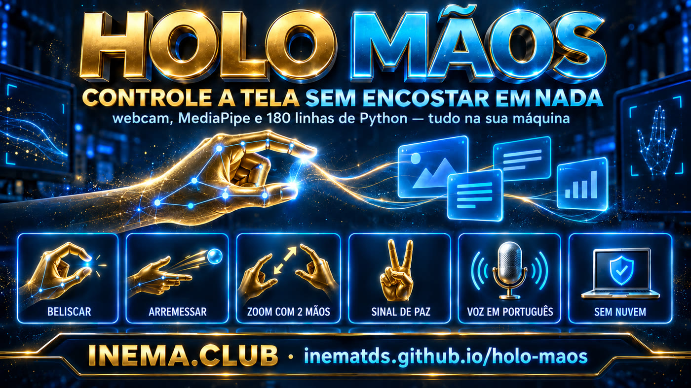

# 🖐️ HOLO Mãos — controla la pantalla con las manos, en portugués

**🇧🇷 [Português](README.md) · 🇺🇸 [English](README.en.md) · 🇪🇸 [Español](README.es.md)**

[](https://inematds.github.io/holo-maos/guia/es/)

## 📖 Guía de uso

Guía completa (landing + paso a paso): **https://inematds.github.io/holo-maos/guia/es/**

Capa de INEMA sobre **HOLO** (Zubair Trabzada, AI Workshop): un «deck» que funciona en el
navegador y transforma tu cámara web en una interfaz: pellizcas una tarjeta en el aire, la arrastras,
la lanzas, juntas las manos para hacer zoom y haces la señal de paz para ordenar todo de nuevo.

Nada va a la nube: el seguimiento de manos es **MediaPipe de Google ejecutándose dentro de la
propia página**, y los cuadros de la cámara no salen de tu equipo. Sin API key, sin cuenta.

> **Este repositorio NO es el proyecto original.** El código de HOLO es de Zubair Trabzada,
> MIT, y está en **https://github.com/zubair-trabzada/holo-gestures**. Aquí están:
> el **análisis** de lo que se puede hacer con esto en INEMA ([ANALISE.md](ANALISE.md)), las
> **evidencias** de que funciona en Linux y la **adaptación a PT-BR**.

## Ejecútalo en 2 minutos

```bash
bash scripts/baixar-upstream.sh     # clona el repo oficial en upstream/
python3 scripts/aplicar-ptbr.py     # aplica la capa PT-BR + notas de INEMA
cd upstream && python3 server.py    # solo la biblioteca estándar de Python 3
```

Abre `http://localhost:4890` en Chrome y permite el acceso a la cámara. ¿No tienes cámara? Usa
`http://localhost:4890/?sim=1` (manos sintéticas); el mouse también funciona para todo.

## Probado aquí (21/09/2026, Linux — spark-922b)

| Elemento | Resultado |
|---|---|
| `python3 server.py` | ✅ se inicia en el puerto 4890, solo stdlib |
| `GET /`, `/api/notes`, `/api/props` | ✅ 200 (página de 88 KB, notas y 2 modelos 3D) |
| La página carga orbes + modelos 3D | ✅ deck armado, sin errores de JS |
| Batería interna `?probe=1` (Chromium headless) | ⚠️ pasó **26/26** una vez y después se quedó en **2/4** — **también en el código original**, sin nuestro parche. Es la prueba que toca la tarjeta antes de que la cámara mapee la pantalla en un navegador sin interfaz; no es una regresión de la traducción |

La documentación original habla
de Mac/Windows; **funciona en Linux sin cambiar una línea**.

## Los gestos

| Haz esto | Ocurre esto |
|---|---|
| Pellizcar una tarjeta (el pulgar toca el dedo) | la toma, arrastra y lanza con inercia |
| Pellizco rápido (toque) | abre la carpeta-orbe / abre la nota |
| Lanzar fuera de la pantalla | la nota desaparece (vuelve al reabrir el orbe) |
| Dos pellizcos separándose/juntándose | zoom; al girar las manos, rota la escena |
| Estirar una tarjeta con las dos manos | grande = abre el lector; arrugada = la voz lee el resumen |
| Mantener la señal de paz ✌ | **deshace cualquier desorden** — el gesto que hay que recordar |
| Tecla `F` | efectos: repulsor, tirón, dibujo, palma, ordenar en cuadrícula |
| Tecla `J` | modo JARVIS: se vuelve dorado y la voz narra lo que hacen las manos |

## La capa en portugués

`scripts/aplicar-ptbr.py` aplica 25 reemplazos exactos en el `holo.html` del upstream:
leyendas de gestos, avisos de cámara, diálogos del mayordomo y la selección de voz (de `en-GB`
fijo a `pt-BR`). Guarda el original en `holo.html.original` y **avisa** si el autor
cambió algún fragmento, en lugar de traducir a medias. Después de un `git pull` en
el upstream, solo hay que volver a ejecutarlo.

Las notas de ejemplo en `notas-inema/` reemplazan las del autor; `holo.json` pasa a
apuntar a ellas automáticamente.

## Tus propias notas

`holo.json` apunta a cualquier carpeta de archivos markdown: las subcarpetas se convierten en orbes,
y los archivos, en tarjetas:

```json
{"folder": "/caminho/para/suas/notas"}
```

## Créditos y licencias

- **HOLO** — Zubair Trabzada / AI Workshop. Código original **MIT**.
  Repo: https://github.com/zubair-trabzada/holo-gestures · Video: https://www.youtube.com/watch?v=wJ3CFmzMbtA
- **MediaPipe Tasks Vision** (Google) Apache-2.0 · **three.js** MIT — incluidos en el upstream.
- **Modelos 3D** — escaneos del Smithsonian (Apollo 11, Triceratops), CC0.
- El **PDF «HOLO Start Here»** y el texto de la publicación son material original de Zubair: **no se
  redistribuyen aquí**, solo se citan como fuente.
- Lo nuestro (análisis, adaptación a PT-BR, guía): MIT, INEMA.
