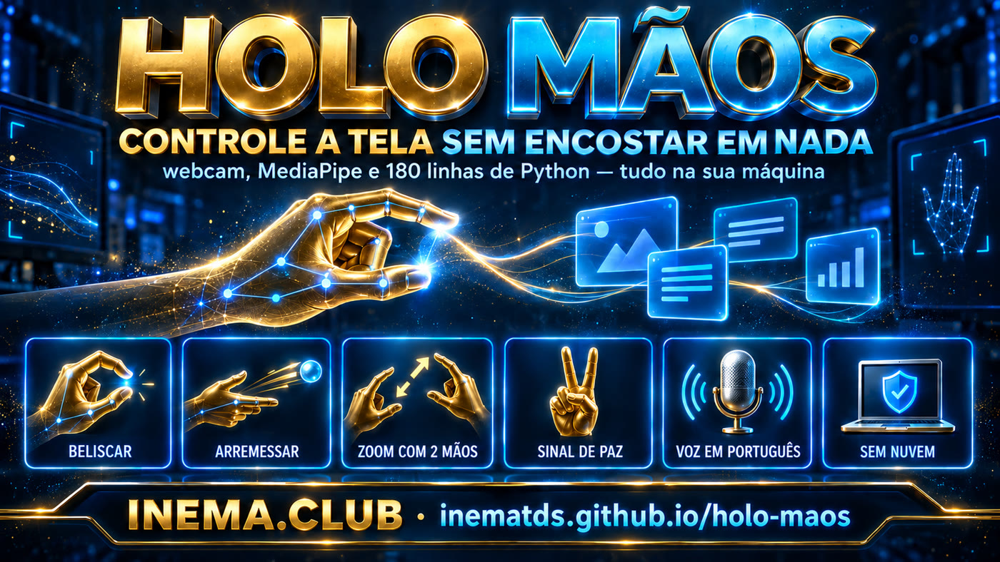

# 🖐️ HOLO Mãos — controle a tela com as mãos, em português

[](https://inematds.github.io/holo-maos/guia/)

## 📖 Guia de uso

Guia completo (landing + passo a passo): **https://inematds.github.io/holo-maos/guia/**

Camada INEMA em cima do **HOLO** (Zubair Trabzada, AI Workshop): um "deck" que roda no
navegador e transforma a sua webcam em interface — você belisca um cartão no ar, arrasta,
arremessa, junta duas mãos pra dar zoom, e faz o sinal de paz pra arrumar tudo de volta.

Nada vai pra nuvem: o rastreamento de mão é o **MediaPipe do Google rodando dentro da
própria página**, e os quadros da câmera não saem da sua máquina. Sem API key, sem conta.

> **Este repositório NÃO é o projeto original.** O código do HOLO é do Zubair Trabzada,
> MIT, e mora em **https://github.com/zubair-trabzada/holo-gestures**. Aqui ficam:
> a **análise** do que dá pra fazer com isso no INEMA ([ANALISE.md](ANALISE.md)), as
> **evidências** de que roda no Linux, e a **adaptação em PT-BR**.

## Rodar em 2 minutos

```bash
bash scripts/baixar-upstream.sh     # clona o repo oficial em upstream/
python3 scripts/aplicar-ptbr.py     # aplica a camada PT-BR + notas do INEMA
cd upstream && python3 server.py    # só a biblioteca padrão do Python 3
```

Abra `http://localhost:4890` no Chrome e libere a câmera. Sem câmera? Use
`http://localhost:4890/?sim=1` (mãos sintéticas) — o mouse também funciona em tudo.

## Testado aqui (21/09/2026, Linux — spark-922b)

| Item | Resultado |
|---|---|
| `python3 server.py` | ✅ sobe na porta 4890, só stdlib |
| `GET /`, `/api/notes`, `/api/props` | ✅ 200 (página 88 KB, notas e 2 modelos 3D) |
| Página carrega orbes + modelos 3D | ✅ deck montado, sem erro de JS |
| Bateria interna `?probe=1` (Chromium headless) | ⚠️ passou **26/26** uma vez e depois ficou parando em **2/4** — **também no código original**, sem o nosso patch. É o teste tocando o cartão antes de a câmera mapear a tela em navegador sem interface; não é regressão da tradução |

A documentação original fala
em Mac/Windows; **roda no Linux sem mudar uma linha**.

## Os gestos

| Faça isso | Acontece isso |
|---|---|
| Beliscar um cartão (polegar encosta no dedo) | pega, arrasta e arremessa com inércia |
| Belisco rápido (toque) | abre a pasta-orbe / abre a nota |
| Arremessar pra fora da tela | a nota some (volta reabrindo a orbe) |
| Dois beliscos afastando/juntando | zoom; torcendo as mãos, gira a cena |
| Esticar um cartão com duas mãos | grande = abre o leitor; amassado = a voz lê o resumo |
| Sinal de paz ✌ mantido | **desfaz qualquer bagunça** — o gesto pra decorar |
| Tecla `F` | efeitos: repulsor, puxão, desenho, palma, arrumar em grade |
| Tecla `J` | modo JARVIS: fica dourado e a voz narra o que as mãos fazem |

## A camada em português

`scripts/aplicar-ptbr.py` aplica 25 substituições exatas no `holo.html` do upstream:
legenda de gestos, avisos de câmera, falas do mordomo e a escolha da voz (de `en-GB`
fixo para `pt-BR`). Guarda o original em `holo.html.original` e **avisa** se o autor
mudou algum trecho, em vez de traduzir pela metade. Depois de um `git pull` no
upstream, é só rodar de novo.

As notas de exemplo em `notas-inema/` substituem as do autor — o `holo.json` passa a
apontar para elas automaticamente.

## Suas próprias notas

`holo.json` aponta pra qualquer pasta de arquivos markdown — subpastas viram orbes,
arquivos viram os cartões:

```json
{"folder": "/caminho/para/suas/notas"}
```

## Créditos e licenças

- **HOLO** — Zubair Trabzada / AI Workshop. Código original **MIT**.
  Repo: https://github.com/zubair-trabzada/holo-gestures · Vídeo: https://www.youtube.com/watch?v=wJ3CFmzMbtA
- **MediaPipe Tasks Vision** (Google) Apache-2.0 · **three.js** MIT — embarcados no upstream.
- **Modelos 3D** — digitalizações do Smithsonian (Apollo 11, Triceratops), CC0.
- O **PDF "HOLO Start Here"** e o texto do post são material autoral do Zubair: **não são
  redistribuídos aqui**, só citados como fonte.
- O que é nosso (análise, adaptação PT-BR, guia): MIT, INEMA.
